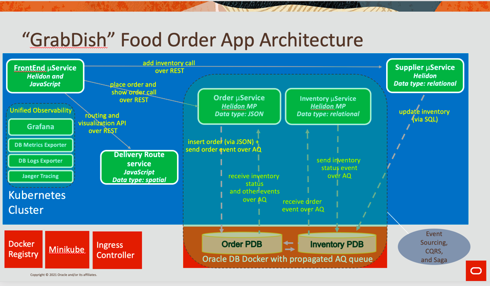

# Standalone- Building Microservices with Converged Oracle Database
## Introduction and Overview

This workshop will help you understand the technical capabilities inside and outside the Oracle converged database to support a scalable data and event-driven microservices architecture.

Standalone - Simplify Microservices on Converged Database Workshop  mimics on-premises environment by using Infrastructure as a Service (IaaS) compute instances from Oracle Cloud Infrastructure (OCI).  Technologies like Docker Registry, Minikube, Ingress Controller, Database 19c Docker container are leveraged in this workshop’s architecture to perform tasks like docker registration, creation of a Kubernetes Cluster, perform Load-balancer capability and to host a Oracle Database instance with 2 PDBs.

As part of the Standalone - Simplify Microservices on Converged Database Workshop,  you will create an application with Helidon microservices and a Javascript front-end, deployed to a minikube Kubernetes cluster, using REST, messaging for communication, and accessing pluggable Oracle databases. Oracle Database is hosted on a docker container.

If you need any help please join the databasehome.slack.com (#microservices) channel.

### Let's Get Started!

Proceed to the next lab.

## Want to Learn More?

* [Multitenant Database – Oracle 19c](https://www.oracle.com/database/technologies/multitenant.html)
* [Oracle Advanced Queuing](https://docs.oracle.com/en/database/oracle/oracle-database/19/adque/aq-introduction.html)
* [Microservices Architecture with the Oracle Database](https://www.oracle.com/technetwork/database/availability/trn5515-microserviceswithoracle-5187372.pdf)
* [https://developer.oracle.com/](https://developer.oracle.com/)

## Acknowledgements
* **Authors** - Vishal Mehra
* **Adapted for Cloud by** -  Nenad Jovicic, Enterprise Strategist, North America Technology Enterprise Architect Solution Engineering Team
* **Contributors** - Jaden McElvey, Technical Lead - Oracle LiveLabs Intern
* **Last Updated By/Date** - Vishal Mehra, October 2021
